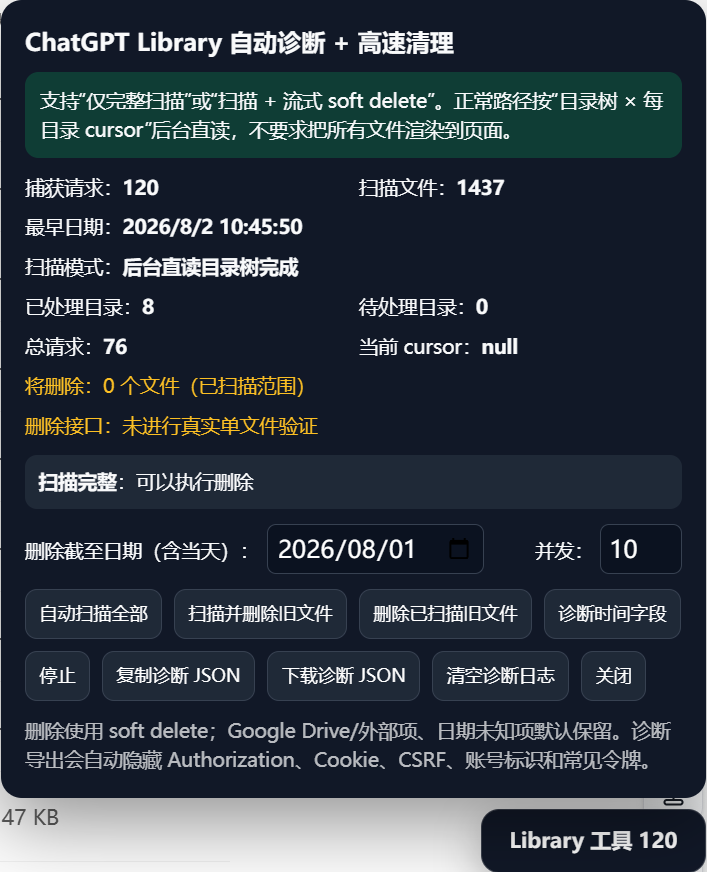

# ChatGPT Library Cleanup Userscript

一个用于 **ChatGPT Library（资料库）** 的 ScriptCat / Tampermonkey 用户脚本，可后台扫描 Library 目录树，并按指定截止日期批量执行 soft delete。

> **[🚀 点击安装 ScriptCat 用户脚本](https://raw.githubusercontent.com/DearJIAN/chatgpt-library-cleanup-userscript/main/chatgpt_library_tool_scriptcat.user.js)**
>
> 建议直接通过 GitHub Raw 安装；安装后在 ScriptCat 中“来源”应显示为 **脚本链接**，而不是“本地脚本”。

> 当前版本：**0.9.1**  
> 适用页面：`https://chatgpt.com/library`

## 目录

- [为什么做这个项目？](#为什么做这个项目)
- [功能](#功能)
- [Library「修改时间」字段实测结论](#library修改时间字段实测结论)
- [扫描状态机与断点续扫](#扫描状态机与断点续扫)
- [安装](#安装)
  - [推荐方式：从 GitHub Raw 直接安装](#推荐方式从-github-raw-直接安装)
- [自动更新](#自动更新)
- [使用方法](#使用方法)
  - [界面说明](#界面说明)
  - [扫描与删除范围（重要）](#扫描与删除范围重要)
  - [1. 打开 Library](#1-打开-library)
  - [2. 设置截止日期](#2-设置截止日期)
  - [3. 选择工作模式](#3-选择工作模式)
  - [4. 停止与继续](#4-停止与继续)
- [安全机制](#安全机制)
  - [首次真实 soft-delete 验证](#首次真实-soft-delete-验证)
  - [删除后的 verification](#删除后的-verification)
- [Google Drive / 外部项目](#google-drive--外部项目)
- [已知限制](#已知限制)
- [项目结构](#项目结构)
- [本地测试](#本地测试)
- [版本记录](#版本记录)
- [License](#license)
- [Disclaimer](#disclaimer)

## 为什么做这个项目？

ChatGPT Library 在长期使用后很容易积累大量上传文件和图片。当文件数量达到数千个时，如果想清理较早的历史文件，官方界面主要依赖逐项加载和手动操作，处理大量旧文件会非常耗时。

这个项目最初就是为了解决这个问题：希望能够按照一个明确的截止日期，自动扫描 ChatGPT Library 中的本地文件，并安全、快速地清理较早的历史文件，而不影响较新的文件以及 Google Drive 等外部来源。

在实际开发过程中，ChatGPT Library 的目录结构、cursor 分页、文件 ID、删除接口、时间字段和扫描中断恢复都经历了多轮真实验证，因此脚本采用了“目录树递归 × 每目录 cursor 分页”、可恢复 checkpoint、soft delete、首次单文件人工确认、fail-closed 和补漏扫描等机制，尽可能降低批量清理时的误删和漏扫风险。

## 功能

- 通过 ChatGPT 网页当前使用的 `/backend-api/files/library/nodes` 接口读取 Library；
- 按“**目录树递归 × 每目录 cursor 分页**”扫描根目录和本地子目录；
- 支持可恢复扫描 checkpoint：扫描中途停止后，若 Library 数据集未发生删除，可从完整 pending frontier 继续，而不是重新从 ROOT 扫描；
- 支持三种工作方式：
  - **自动扫描全部**：只扫描，不删除；partial 状态下优先从 checkpoint 继续；已经完整扫描时不重复扫描；
  - **扫描并删除旧文件**：无现成扫描状态时使用流式 producer/consumer；partial + 有效 checkpoint 时先续扫到完整再删除；已经完整扫描时直接复用现有 records，不重新扫描；
  - **删除已扫描旧文件**：不继续扫描，只处理当前已经扫描到的 records；
- 截止日期按 Library UI 已实测对应的 `updated_at` 判断；`updated_at` 缺失、为空或非法时默认保留，不回退到创建/上传时间；
- 支持 1～20 并发删除，默认并发为 10；
- 对 429、408、5xx 和网络错误执行有限重试与退避；
- 首次真实删除先执行单文件 probe，成功后要求用户确认该文件确实从 Library 主列表消失，再继续批量删除；
- 清理完成后最多执行 3 轮从 ROOT 重新开始的 verification scan，用于补漏和确认最终状态；
- 成功 soft-delete 的记录会从当前内存 records 中移除，避免 target preview 再次把已删除文件算作目标；
- 删除发生后旧 checkpoint 立即失效，防止在已经变化的数据集上继续使用旧 cursor；
- 排除 Google Drive / external 项、文件夹、日期未知项目和身份字段不完整的文件；
- 支持随时停止；停止后不再领取新任务，已经发出的请求允许自然结束；
- 支持复制 / 下载脱敏诊断 JSON；
- 支持“诊断时间字段”：保留 nodes 响应中的原始时间字段，并与当前 DOM 可见的“修改时间”进行对照；若未来出现唯一 UI 匹配与已验证 `updated_at` 不一致，会给出 schema-drift 警告。

## Library「修改时间」字段实测结论

### 结论

经过多轮后台字段诊断和最终的可控重命名实验，可以确认：

> **ChatGPT Library 文件列表中显示的「修改时间」对应 `/backend-api/files/library/nodes` 返回的 `updated_at` 字段。**

它不是 `record_creation_time`，也不是 `file_upload_time` 或 `file_processed_time`。

### 为什么需要专门验证？

Library 的一个文件通常同时存在多组时间字段，例如：

```text
record_creation_time
file_upload_time
updated_at
file_processed_time
```

大多数刚上传的文件中，这几个时间只相差几秒，甚至 `record_creation_time` 与 `updated_at` 完全相同。而 Library UI 对当天文件通常只显示到分钟，对较早文件还可能只显示“昨天”“星期日”或具体日期。因此，单纯观察普通文件时，多组后台字段往往都会与 UI 表面匹配，无法判断 UI 真正使用的是哪一个字段。

项目在 0.8.5～0.8.7 中逐步加入了时间字段诊断、高信息量样本排序、本地日期区分和 fail-safe 提示。对 1400 余个真实 Library 文件进行扫描后，仍没有找到候选字段跨本地日期的天然样本，因此最终采用了可控重命名实验进行裁决。

### 可控重命名实验

实验对象原始文件：

```text
39fc6fe6-0358-432c-b57d-19f8df904b47.png
```

重命名前，UI 显示：

```text
修改时间：10:05
```

对应后台字段约为：

```text
record_creation_time  → 10:05:32
file_upload_time      → 10:05:31
updated_at            → 10:05:32
file_processed_time   → 10:05:32
```

随后只执行文件重命名，不重新上传、不替换文件内容：

```text
time-field-probe-renamed.png
```

重命名后、刷新页面之前，现有 DOM 仍显示旧值 `10:05`；刷新 Library 后，UI 的「修改时间」变为：

```text
10:37
```

重新扫描后台数据后发现：

```text
record_creation_time  → 10:05:32   # 未变化
file_upload_time      → 10:05:31   # 未变化
updated_at            → 10:37:19   # 唯一变化
file_processed_time   → 10:05:32   # 未变化
```

诊断器此时得到唯一匹配：

```text
UI 修改时间：10:37
匹配：updated_at (updated_at)
ambiguous：false
```

因此该实验形成了完整的因果证据链：**重命名操作只更新 `updated_at`，页面刷新后 UI「修改时间」同步变化到同一分钟，而其他候选时间字段保持原值。**

### 这对删除语义意味着什么？

从 **0.8.8** 起，真正的截止日期判断已正式与 Library UI「修改时间」对齐：删除资格以 `updated_at` 为准，而不再把 `record_creation_time` / `file_upload_time` 当作删除时间。

需要区分两个不同概念：

- **创建 / 首次进入 Library 的时间**：更接近 `record_creation_time` / `file_upload_time`，继续保留在诊断数据中；
- **Library UI 的「修改时间」**：已实测确认对应 `updated_at`，文件重命名等修改会推进该时间；从 0.8.8 起也是删除截止日期的真实依据。

0.8.9 进一步收紧 fail-closed 语义：真正删除时间只接受 `deletionAt`（由扫描阶段从 `updated_at` / `updatedAt` 提取）或直接的 `updated_at` / `updatedAt`。如果 `updated_at` 缺失、为 `null`、为空或无法解析，文件会默认保留；**不会**回退到 `record_creation_time`、`file_upload_time`、`created_at`、`modified_at`、`file_processed_time` 等其他时间字段。

0.9.0～0.9.1 继续保留该诊断器：如果当前能够唯一区分的 UI 样本仍匹配 `updated_at`，面板会明确提示“与已验证结论一致”；如果未来出现唯一匹配指向其他字段，则只给出 schema-drift 警告并建议停止批量删除、重新核验，**不会自动猜测并切换真实删除字段**。

## 扫描状态机与断点续扫

从 0.9.0 起，扫描逻辑不再把“开始扫描”简单等同于“从 ROOT 清空重来”，而是根据当前状态选择三条路径。

### 1. Fresh scan

当前没有可复用记录或有效 checkpoint 时，从 ROOT 开始新扫描。

如果用户直接点击“扫描并删除旧文件”，fresh 状态继续使用原来的流式 producer/consumer：扫描器读取新页面，符合条件的文件进入删除队列，删除 worker 与扫描器并行工作。

### 2. Partial scan + checkpoint resume

扫描中途点击“停止”后，脚本会保留：

- 已扫描 `records`；
- 待处理的完整 directory/cursor frontier；
- 已访问的 directory/cursor states；
- 已排队目录；
- 每目录分页计数；
- 当前扫描签名和 seed 信息。

只要这期间 **Library 数据集没有发生真实删除**，再次点击“自动扫描全部”会继续未完成 frontier；点击“扫描并删除旧文件”则先从 checkpoint 继续扫到完整，再基于完整结果执行删除。

这不是只保存一个 `currentCursor`。保存完整 frontier 的原因是：Library 同时存在目录树和每目录自己的 cursor，单独恢复一个 cursor 可能遗漏已经排队但尚未处理的其他目录。

### 3. Complete scan reuse

如果 `scan.complete=true` 且现有 records 已经完整，点击“扫描并删除旧文件”会**直接复用当前完整扫描结果**，不会先把 records 清空再从 ROOT 重扫。

这解决了旧版本中“刚刚完整扫描一遍，准备删除时又无条件重新扫描一遍”的浪费。

### 为什么删除后 checkpoint 必须失效？

任何真实 soft-delete 都会改变 Library 数据集。内部 cursor 没有公开稳定性保证，所以一旦发生删除：

```text
旧 checkpoint → invalid
旧 cursor     → 不再允许继续使用
```

如果之前只是 partial scan，此后还想继续扫描未扫描部分，必须从 ROOT 开始一个新的 fresh scan。

verification scan 本来就需要从 ROOT 重新开始，因此不复用清理前的 checkpoint。

## 安装

需要先安装支持 Userscript 的浏览器扩展，例如：

- ScriptCat
- Tampermonkey

### 推荐方式：从 GitHub Raw 直接安装

**不要把“新建脚本 → 复制源码 → 保存”作为常规安装方式。** 这种方式可能被 ScriptCat 识别为“本地脚本”，即使源码里存在 `@updateURL` / `@downloadURL`，也可能没有建立正常的远程更新来源。

推荐直接在浏览器中打开：

```text
https://raw.githubusercontent.com/DearJIAN/chatgpt-library-cleanup-userscript/main/chatgpt_library_tool_scriptcat.user.js
```

ScriptCat / Tampermonkey 会自动识别 Userscript，并弹出安装或更新页面。确认后点击安装 / 更新即可。

安装成功后，建议在 ScriptCat 的脚本列表中检查“来源”一栏应为：

```text
脚本链接
```

而不是：

```text
本地脚本
```

如果已经通过复制源码的方式安装旧版本，可以直接打开上面的 GitHub Raw `.user.js` 地址覆盖更新现有脚本。

## 自动更新

脚本内置：

```text
@updateURL
@downloadURL
@homepageURL
@supportURL
```

更新与下载地址均指向完整的 GitHub Raw `.user.js`：

```text
https://raw.githubusercontent.com/DearJIAN/chatgpt-library-cleanup-userscript/main/chatgpt_library_tool_scriptcat.user.js
```

更新链路：

```text
修改 userscript
    ↓
提高 @version / SCRIPT_VERSION
    ↓
git commit + push main
    ↓
GitHub Raw 指向 main 最新脚本
    ↓
ScriptCat 检查 @updateURL
    ↓
发现远端版本高于本地
    ↓
通过 @downloadURL 更新脚本
```

需要注意：

- GitHub 出现新 commit **不等于** ScriptCat 一定认为有新版本；
- 真正发布脚本功能或行为变化时，必须同步提高 `@version`；
- `@version` 与内部 `SCRIPT_VERSION` 必须保持一致；
- README、图片、CHANGELOG、LICENSE 等纯文档修改，不需要提升 userscript 版本；
- 如果 ScriptCat 中“来源”仍显示“本地脚本”，优先重新通过 GitHub Raw `.user.js` 覆盖安装一次。

## 使用方法

### 界面说明

下面是脚本在 ChatGPT Library 中真实运行时的界面示例。截图中的文件数量、日期和删除进度仅用于说明界面，实际数值会随你的 Library 内容变化。



### 扫描与删除范围（重要）

> **本地项目文件夹并不是“保护区”。** 脚本会递归进入所有本地 Library 文件夹 / 项目目录；项目内部的文件只要满足截止日期和安全校验，也会进入 soft-delete 队列。

具体范围：

- **Library 根目录中的普通文件**：会扫描；满足截止日期条件时会删除；
- **本地项目 / 文件夹中的文件**：会递归扫描；满足截止日期条件时同样会删除；
- **本地文件夹本身**：不会被脚本删除；
- **Google Drive / external 目录及其内部内容**：整棵目录树忽略，不扫描、不删除；
- **`updated_at` 缺失、为空、非法，或身份字段异常 / 来源无法确认的项目**：默认保留。

例如：

```text
Library
├─ old-root-file.pdf            # 根目录文件：可能删除
├─ 论文/
│  ├─ old-paper.pdf             # 项目内文件：可能删除
│  └─ new-paper.pdf             # 修改时间超过截止日期：保留
├─ PPT/
│  └─ old-slide.pptx            # 项目内文件：可能删除
└─ Google Drive/                # 整棵树忽略
   └─ any-file.pdf              # 不扫描、不删除
```

面板中的主要信息包括：

- **捕获请求**：当前页面已捕获到的 Library 相关网络请求数量；
- **扫描文件**：当前内存 records 中识别出的 Library 本地文件数量；成功删除的记录会被移出该集合；
- **最早日期**：当前 records 中最早的有效 `updated_at`；
- **扫描模式**：显示 fresh / resume / verification 等目录树扫描状态；
- **已处理目录 / 待处理目录**：当前 scan pass 的目录树遍历进度；verification 每一轮会重新计数，不与旧 pass 累加；
- **总请求 / 当前 cursor**：当前 scan pass 的后台分页状态；
- **将删除**：idle 时根据当前 records + cutoff 重新计算；只有真正扫描/删除进行中时才显示 active queue；
- **删除接口**：动态显示当前页面 session 是否已经通过首次真实单文件验证；
- **状态栏**：显示扫描、删除、停止或“清理验证完成”等当前 lifecycle 状态；
- **删除截至日期（含当天）**：按文件 `updated_at` / UI「修改时间」决定哪些旧文件进入删除目标；
- **并发**：删除 worker 数量，范围 1～20，默认 10。

### 1. 打开 Library

进入：

```text
https://chatgpt.com/library
```

首次安装或更新脚本后，建议刷新一次 Library 页面，让脚本捕获当前页面真实的 `/backend-api/files/library/nodes` 请求。

### 2. 设置截止日期

例如选择：

```text
2026-08-01
```

实际规则：

- `updated_at` 的本地日期为 `2026-08-01` 当天及以前：删除；
- `updated_at` 为 `2026-08-02 00:00:00` 及以后：保留；
- `updated_at` 缺失、为空或无法解析：保留。

内部使用“**所选日期次日 00:00 的 exclusive end**”进行比较。

### 3. 选择工作模式

#### 自动扫描全部

只扫描 Library，不执行删除。

- 没有现成状态：从 ROOT fresh scan；
- partial + checkpoint 有效：从断点继续；
- 已完整扫描：不重复重扫。

#### 扫描并删除旧文件

该按钮不是固定一种执行路径，而是“**确保扫描完整，然后执行完整清理**”：

- **fresh**：使用流式扫描 + 删除队列；
- **partial + checkpoint**：先续扫到完整，再删除；
- **complete**：直接复用现有完整 records，删除前不重新扫描。

如果真实删除发生，旧 checkpoint 会立即失效；清理后的完整性由新的 ROOT verification scan 重新建立。

#### 删除已扫描旧文件

不继续扫描，只处理当前 `state.scan.records` 中已经扫描到的记录。

适合明确只想清理“目前已经扫到的这一批”的场景。未扫描部分不处理，也不会自动 resume。

如果此模式真的删除了文件，旧 checkpoint 同样会失效；之后如需扫描未覆盖部分，要从 ROOT fresh scan。

### 4. 停止与继续

点击“停止”后：

- 不再领取新的扫描状态；
- 删除 worker 不再领取新任务；
- 已经发出的请求允许自然结束；
- 不会回滚此前已经 soft-delete 的文件；
- 如果停止前没有发生真实删除，checkpoint 会保留，可用于后续 resume；
- 如果已经发生真实删除，checkpoint 会失效，后续必须 fresh scan。

## 安全机制

脚本在删除前会检查：

- `libraryFileId` 必须为有效 `libfile_...`；
- `fileId` 必须符合当前已观察到的 `file_...` / `file-...` 形式；
- verified `updated_at`（内部删除时间）必须存在且可解析；
- 文件的 `updated_at` 必须早于“截止日期次日 00:00”的 exclusive end；
- `updated_at` 缺失或非法时 fail closed，默认保留，不以创建、上传、处理或其他 modified 字段代替；
- external / Google Drive 项必须排除；
- 相同 `libraryFileId` 不会重复入队删除；
- 成功删除后立即使旧 checkpoint 失效；
- 成功删除的 `libraryFileId` 会从当前 records 中 prune，避免 stale preview 和重复删除；
- 诊断器若发现当前唯一 UI 匹配与已验证 `updated_at` 冲突，会给出 schema-drift 警告，不自动切换删除字段。

删除使用当前网页内部的 soft-delete 路径，不执行永久删除，也不会主动清空 Recently deleted。

### 首次真实 soft-delete 验证

首次当前页面 session 的真实清理，不会仅凭 HTTP 成功就放开整批删除：

1. 先 soft-delete 1 个目标；
2. 请求成功后暂停；
3. 弹窗显示测试文件名和 `libraryFileId`；
4. 用户人工确认该文件确实从 Library 主列表消失；
5. 只有确认后才继续剩余并发删除。

该安全门已经在真实 Library 中完成过人工验收。测试文件：

```text
Transformer注意力机制信息图解.png
```

其首个 soft-delete 请求成功后，用户实际在 Library 中搜索并确认该文件已从主列表消失，随后才继续剩余目标。

该验证只在**当前页面 session**中记忆；刷新页面后会重新要求首次单文件验证，这是有意设计的安全策略。

### 删除后的 verification

完整清理完成后，脚本最多执行 3 轮 verification：

```text
从 ROOT fresh scan
    ↓
重新遍历目录树 × cursor
    ↓
筛选仍符合 cutoff 的目标
    ↓
有遗漏则继续 soft delete
    ↓
再次从 ROOT 验证
```

只有某一轮完整扫描确认 0 个剩余目标时，才显示：

```text
清理验证完成：未发现遗漏旧文件。
```

verification 每一轮都有独立的 scanning lifecycle；成功、异常或停止后都会恢复 `scanning=false`。当前 pass 的目录数、请求数和 cursor 也会重新计数，不与清理前的扫描累加。

## Google Drive / 外部项目

Google Drive 和其他明确识别出的 external 项不会进入本地目录递归和删除队列。

如果 Library 中出现未来新增的外部 provider，而脚本无法可靠识别，建议先使用“自动扫描全部”和诊断 JSON 检查，再决定是否删除。

## 已知限制

本项目依赖 ChatGPT 网页的**内部接口**，不是公开稳定 API。ChatGPT 网页更新后，endpoint、字段或分页结构可能变化。

当前主要依赖：

```text
GET /backend-api/files/library/nodes
POST /backend-api/files/library/files/{library_file_id}/delete_stream
```

当前“UI 修改时间 = `updated_at`”结论来自 2026-09-02 的真实页面与可控重命名实验。若 ChatGPT 后续改变字段语义，脚本不会把其他时间字段自动猜作替代；诊断器若发现唯一 UI 样本与 `updated_at` 冲突，会警告停止批量删除并重新核验。

扫描 checkpoint 只用于当前页面运行期，并且只在 Library 数据集未被脚本删除修改时有效。真实删除后旧 cursor/checkpoint 会被主动废弃，这是为了避免在变化后的数据集上继续旧分页状态。

因此脚本采用 fail-closed 策略：遇到未知 schema、异常 cursor、身份字段异常、`updated_at` 不可确认、checkpoint 不一致或关键请求失败时，优先保留/停止，而不是猜测并继续删除。

## 项目结构

```text
.
├─ chatgpt_library_tool_scriptcat.user.js   # Userscript 主脚本
├─ test/
│  └─ library_tool.test.cjs                 # Node.js 测试
├─ docs/
│  └─ images/
│     └─ library-tool-panel.png             # README 界面示例
├─ README.md                                # 使用说明
├─ CHANGELOG.md                             # 版本变更记录
└─ LICENSE                                  # MIT License
```

## 本地测试

需要 Node.js。

```bash
node --test test/library_tool.test.cjs
node --check chatgpt_library_tool_scriptcat.user.js
git diff --check
```

## 版本记录

完整版本演进、历史 bug、修复原因和对应提交见：

[CHANGELOG.md](CHANGELOG.md)

## License

本项目采用 [MIT License](LICENSE)。

Copyright (c) 2026 DearJIAN

## Disclaimer

本项目为非官方工具，与 OpenAI 无隶属关系。脚本操作的是当前登录账号中的 Library 数据；批量删除前请自行确认截止日期、目标数量和删除行为符合预期。